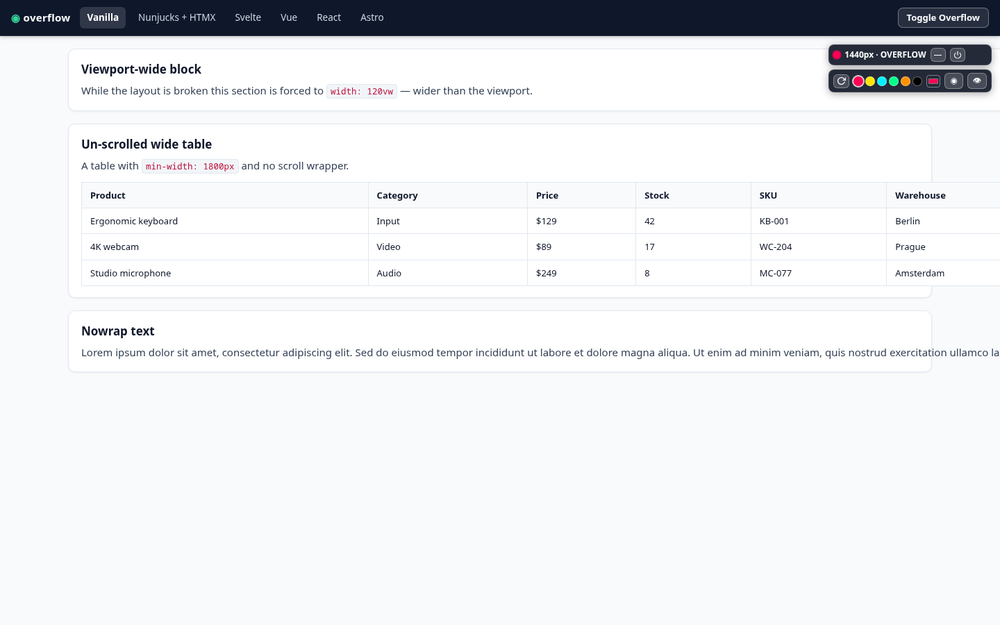
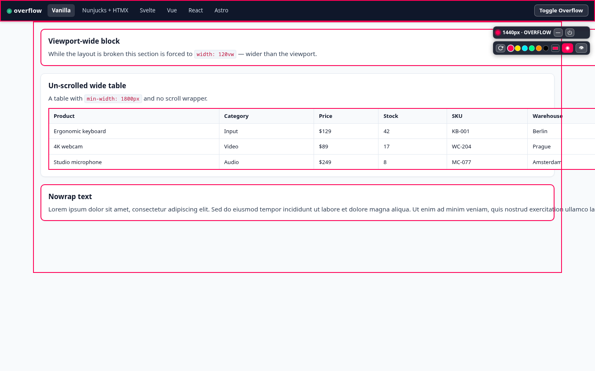
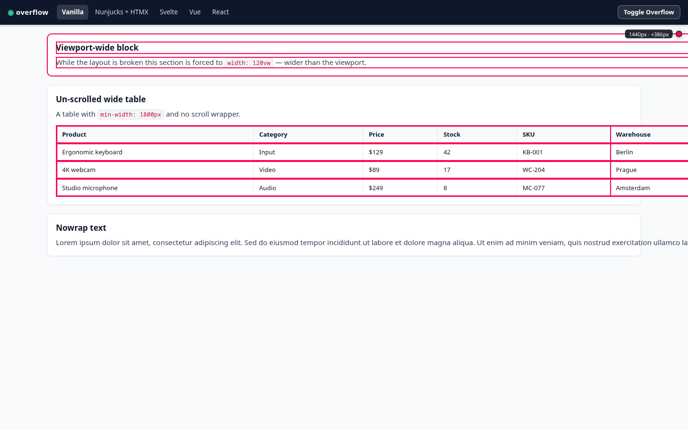
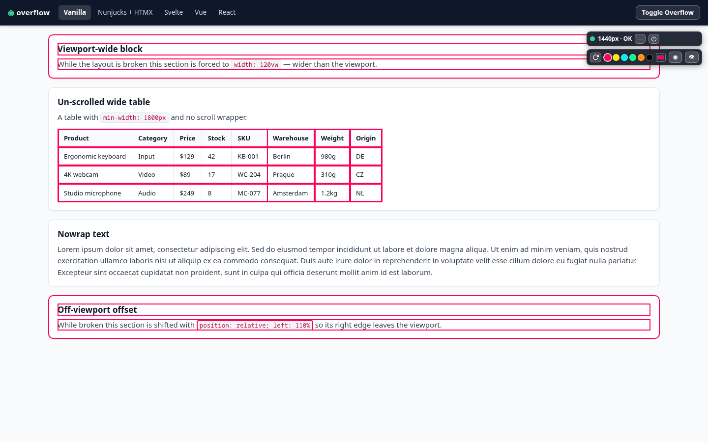

# debug-css-overflow

[](https://www.npmjs.com/package/debug-css-overflow)
[](https://github.com/vinyardrip/debug-css-overflow/blob/main/LICENSE)
[](https://bundlephobia.com/package/debug-css-overflow)
[](https://github.com/vinyardrip/debug-css-overflow)

Zero-dependency dev utility that detects **horizontal overflow** (`overflow-x`), highlights the offending elements, and shows a small floating widget — fully isolated inside **Shadow DOM**.

- 🎯 Detects whole-page overflow (`scrollWidth > innerWidth`) **and** individual offenders (`offsetWidth` / `getBoundingClientRect().right` beyond the viewport, with a 1px subpixel tolerance).
- 🧬 Parent deduplication: nested overflowing structures (`table > tbody > tr > td`, nested grid/flex layouts) are collapsed to their top-most ancestors — duplicate counts and stacked outlines are eliminated, so counts, outlines, and tooltips report root-level offenders only (e.g. `1 el.` instead of `11 el.` for one wide table).
- 🔍 Expanded tooltip metrics: on hover the widget reports the total top-level offender count (`Offending elements: {count}`) and detailed geometry for the top offender — `Element width: {width}px (right edge: {rightEdge}px)` plus the viewport excess (`+{excess}px`). The right edge is surfaced only when it differs from the width (shifted elements), so the overflow math is always transparent.
- 🔦 Hotkey toggles outline highlights on offending elements and layout containers — works even when the auto-status is "OK".
- 📦 Zero runtime dependencies; framework-agnostic; tree-shaken out of production bundles (no DOM access until `initDebugCssOverflow()` is called).
- 🧩 Widget, tooltip, and modal live in a Shadow Root — host CSS cannot leak in, widget CSS cannot leak out.
- 📡 Event-driven scanning: `resize` + `MutationObserver` + `ResizeObserver` (debounced), no `setInterval` polling.
- 🎛️ UI preferences (position, accent color, minimized state, badge visibility) persist in `localStorage`.

## Install

Add it as a **dev dependency** — it's meant for development, and it's tree-shaken out of production builds.

```bash
# npm
npm install -D debug-css-overflow

# pnpm
pnpm add -D debug-css-overflow

# yarn
yarn add -D debug-css-overflow

# bun
bun add -d debug-css-overflow
```

## Quick Start

### With a bundler (Vite, webpack, etc.)

```ts
import { initDebugCssOverflow } from "debug-css-overflow";

// Dev-only, e.g.:
if (import.meta.env.DEV) {
  initDebugCssOverflow();
}
```

### Plain HTML (no build step)

Drop the pre-built bundle in with a `<script>` tag — either from a CDN or your own `node_modules` copy:

```html
<script src="https://unpkg.com/debug-css-overflow/dist/index.global.js"></script>
<!-- or: https://cdn.jsdelivr.net/npm/debug-css-overflow/dist/index.global.js -->
<script>
  DebugCssOverflow.initDebugCssOverflow();
</script>
```

### With options

```ts
import { initDebugCssOverflow } from "debug-css-overflow";

const detector = initDebugCssOverflow({
  position: "top-right",
  offset: { top: 64 }, // clear a fixed top navbar (52px + 12px gutter)
  accentColor: "#ff0055",
  onChange: (state) => console.log("overflow state:", state),
});
```

`initDebugCssOverflow()` returns a controller (or `null` when `enabled: false`) and dispatches a `debug-css-overflow:change` `CustomEvent` on `document` whenever the overflow state changes.

```ts
// From the controller:
detector?.toggleHighlight(); // toggle container outlines
detector?.setMinimized(true); // collapse the widget to a dot
detector?.setOffset({ top: 96 }); // follow a (re-)wrapped fixed header in place
detector?.destroyed; // true once destroyed — every method is then a safe no-op
detector?.destroy(); // remove the widget and stop scanning
```

## Astro View Transitions (ClientRouter)

On the first successful `initDebugCssOverflow()` the library wires its own listeners for the Astro ClientRouter lifecycle events on `document` — no extra API calls needed:

- **`astro:after-swap`** — the swapped-out DOM discarded the widget host, so the stale instance is torn down (observers, listeners, detached nodes).
- **`astro:page-load`** — a fresh detector is created for the "new" page from the last options — **but only when there is none**. Apps that re-initialize the detector themselves inside their own `astro:page-load` handler (e.g. recomputing `offset.top` from the *current* rendered header height) register that handler first, so their instance is already live when the library's runs; the library **adopts** it instead of replacing it. This keeps the behavior order-independent: a dynamically recomputed offset is never silently swapped for the stale boot-time one, and controller references the app holds (for `setOffset()` calls from header-following observers) never end up pointing at a destroyed instance.

A deliberate teardown — the widget's **"disable for this session"** button, `destroyDebugCssOverflow()`, or `initDebugCssOverflow({ enabled: false })` — is honored across navigations: nothing is resurrected by later lifecycle events.

## Options

| Option            | Type                              | Default       | Description                                              |
| ----------------- | --------------------------------- | ------------- | -------------------------------------------------------- |
| `enabled`         | `boolean`                         | `true`        | `false` → nothing is created at all.                     |
| `minimized`       | `boolean`                         | `false`       | Start collapsed into a dot.                              |
| `position`        | `"top-right" \| "top-left" \| "bottom-left" \| "bottom-right"` | `"top-right"` | Widget corner. |
| `offset`          | `{ top?, right?, bottom?, left? }` (px) | `{}` | Displace the widget from the viewport edge, overriding the default 12px gutter for the edges given — e.g. `{ top: 64 }` clears a fixed top navbar. Only edges matching the current position are applied. |
| `accentColor`     | `string`                          | `"#ff0055"`   | Highlight + widget accent color.                         |
| `showMetricsBadge`| `boolean`                         | `true`        | Show the compact metrics badge when minimized.           |
| `hotkeys`         | `{ toggleHighlight?, toggleMinimize? }` | `{ toggleHighlight: "Alt+O", toggleMinimize: "Ctrl+Alt+O" }` | Keyboard shortcuts. |
| `storagePrefix`   | `string`                          | `"dcso:"`     | Prefix for localStorage keys.                            |
| `onChange`        | `(state: OverflowState) => void`  | —             | Called whenever the overflow state changes.              |

## Hotkeys

- **Alt+O** — toggle container outline highlights.
- **Ctrl+Alt+O** — collapse / expand the widget to a dot.

## Development

```bash
pnpm install
pnpm typecheck   # strict TypeScript check
pnpm test        # vitest (unit geometry + E2E widget tests)
pnpm build       # tsup → dist/index.mjs, dist/index.cjs, dist/index.global.js (+ .d.ts)
```

`prepublishOnly` runs `pnpm build && pnpm test` so unbuilt or failing code can never be published. The screenshot suite additionally needs a Chromium binary: either the Playwright-managed one (`npx playwright install chromium`) or any system Chrome/Chromium.

## Playground & screenshots

`tests_plugin/` is a Vite multi-page playground that showcases and visually tests the widget across six routes. Every route features the same sticky, dark-themed DevTools header — the fixed top navbar — whose **Toggle Overflow** button flips `body.layout-broken` to dynamically trigger or clear the intentional overflow breakages across the shared test cases (`width: 120vw`, an un-scrolled wide `<table>`, `white-space: nowrap`, `left: 110%`):

| Route | Stack |
| ----- | ----- |
| `/vanilla/` | Plain HTML + TypeScript |
| `/nunjucks/` | Nunjucks + HTMX (dynamic DOM insertion) |
| `/svelte/` | Svelte 5 (scoped CSS) |
| `/vue/` | Vue 3 (scoped CSS) |
| `/react/` | React 19 |
| `/astro/` | Astro View Transitions emulation (pure client-side — no `astro` package) |

```bash
cd tests_plugin && pnpm dev   # http://localhost:5173
```

The `/astro/` route extends the DevTools toolbar with an interactive ClientRouter control panel: simulation buttons (**Simulate Navigation**, **Simulate After Swap**, **Simulate Page Load**), a ⓘ tooltip explaining the emulation, and live metrics (`hosts`, `styles`, `overflow`, `last event`) that update in real time as each simulation runs — confirming a clean teardown (`hosts: 0`) and a fresh mount (`hosts: 1`) on every simulated navigation, without memory leaks or duplicate instances. On every `astro:page-load` the widget's `offset.top` is recomputed from the **current rendered geometry** of the (possibly wrapped) navbar and toolbar, so after resizing until the toolbar buttons stack into multiple rows, the badge remounts strictly below them with a 12px gutter — never overlapping the action buttons. The route is a lightweight emulation, not a real Astro app — Astro is a standalone meta-framework and is not layered into the Vite dev server — dispatching the same native `astro:after-swap` / `astro:page-load` DOM events the Astro ClientRouter emits. The control panel is fully responsive: on narrow viewports the title, metrics, and buttons wrap into stacked rows, and the tooltip never exceeds the viewport edge.

The playground's sticky DevTools header is fully responsive on mobile: at viewports `<= 640px` the six framework tabs collapse from text labels to compact framework SVG icons (Vanilla, Nunjucks, Svelte, Vue, React, Astro) so brand, tabs, and the Toggle Overflow button fit on one line — every tab keeps its full accessible name via `title`/`aria-label`.

`pnpm test:screenshot` (alias `pnpm capture`) drives the whole playground headlessly with **Playwright**: it boots the Vite dev server, visits every route at `1440x900` (plus a `375x812` mobile overflow pass), and captures four states — overflown, highlighted, minimized, and clean — into `.github/assets/`:

| State | Preview |
| ----- | ------- |
| `demo-danger.png` — widget reports offenders (`OVERFLOW`) |  |
| `demo-highlight.png` — container outlines on |  |
| `demo-minimized.png` — collapsed dot + metrics badge |  |
| `demo-clean.png` — no overflow, status `OK` |  |

Per-route copies live in `.github/assets/<route>/`, and mobile danger shots in `.github/assets/mobile/`.

The suite runs headless Chromium through Playwright and resolves the browser gracefully — first the Playwright-managed build, then the system Chrome/Chromium. Install the managed browser once:

```bash
npx playwright install chromium
```

or point the suite at a specific system binary when needed:

```bash
PLAYWRIGHT_CHROMIUM_EXECUTABLE_PATH=/usr/bin/google-chrome-stable pnpm test:screenshot
# also honored: CHROME_PATH, CHROMIUM_PATH
```

The playground, screenshot scripts, and generated assets are dev-only and excluded from the published package via the `files: ["dist"]` allowlist.

## License

[MIT](./LICENSE) © vinyardrip
